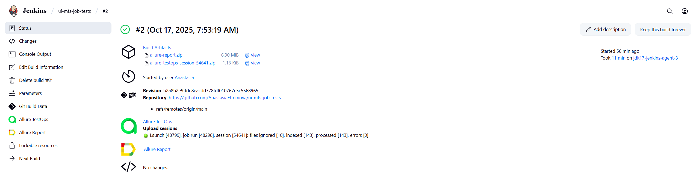
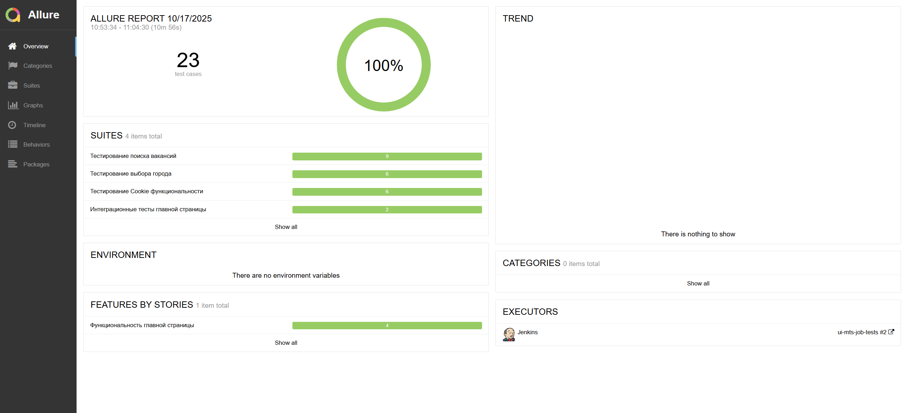
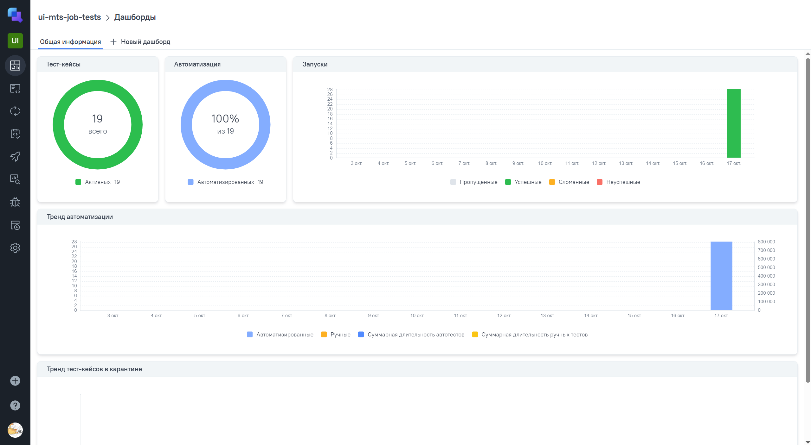
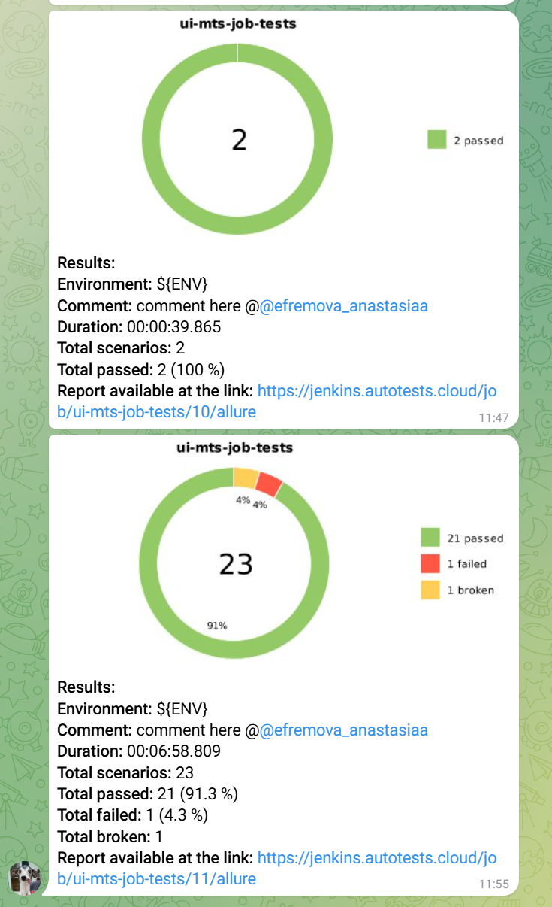
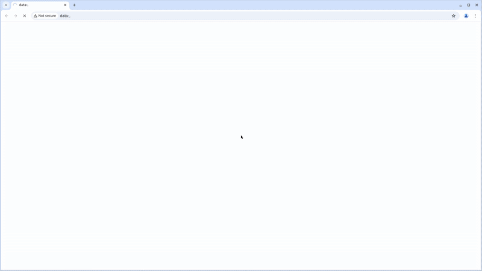

# Проект автоматизации тестирования для MTS IT Jobs


> Проект автоматизированного тестирования портала карьеры MTS Bank IT.

## 📋 О проекте

Проект включает автоматизированные тесты для [портала MTS IT Jobs](https://job.mtsbank.ru/it), охватывающие:
- Управление cookies - принятие и настройка
- Выбор города - обработка географического местоположения
- Поиск вакансий - функциональность поиска IT-вакансий
- Валидацию UI компонентов
- Интеграционное тестирование пользовательских сценариев

---

## 📚 Содержание

- [Технологии и инструменты](#технологии-и-инструменты)
- [Архитектура тестов](#архитектура-тестов)
- [Тест-кейсы](#тест-кейсы)
- [Запуск тестов](#запуск-тестов)
- [Сборка в Jenkins](#-сборка-в-jenkins)
- [Allure отчет](#-allure-отчет)
- [Интеграция с TestOps](#-интеграция-с-testops)
- [Интеграция с Jira](#-интеграция-с-jira)
- [Телеграмм-бот с уведомлениями о результатах тестов](#-телеграмм-бот-с-уведомлениями-о-результатах-тестов)
- [Пример записи видео при выполнении тестов в Selenoid](#-пример-записи-видео-при-выполнении-тестов-в-selenoid)

---

<a id="технологии-и-инструменты"></a>
## 🛠 Технологии и инструменты

<p align="center">  
<a href="https://www.jetbrains.com/idea/"></a>  
<a href="https://www.java.com/"></a>  
<a href="https://github.com/"></a>  
<a href="https://junit.org/junit5/"></a>  
<a href="https://gradle.org/"></a>  
<a href="https://selenide.org/"></a>  
<a href="https://aerokube.com/selenoid/"></a>
<a href="https://qameta.io/"></a>   
<a href="https://www.jenkins.io/"></a>  
<a href="https://www.atlassian.com/ru/software/jira/"></a>  
</p>

---

<a id="архитектура-тестов"></a>
## 🏗 Архитектура тестов

```bash
src/test/java/
├── components/              # Компоненты страниц
│   ├── CityConfirmComponent.java
│   ├── CookieNoticeComponent.java
│   └── SearchComponent.java
├── config/                  # Конфигурация
│   └── MainConfig.java
├── helpers/                 # Вспомогательные классы
│   └── Attach.java          # Вложения для отчетов
├── pages/                   # Page Object модели
│   └── ItJobPage.java       # Главная страница
├── tests/                   # Тестовые классы
│   ├── TestBase.java        # Базовый класс тестов
│   ├── mtsJob/
│   │   ├── CityTests.java
│   │   ├── CookieTests.java
│   │   ├── IntegrationTests.java
│   │   └── SearchTests.java
└── utils/                   # Утилиты
    └── FakerTestData.java
````


---

<a id="тест-кейсы"></a>
## ✅ Тест-кейсы

🍪 Тесты cookie-баннера
✓ Проверка отображения cookie баннера

✓ Проверка текста кнопок cookie баннера

✓ Проверка кликабельности кнопок cookie

✓ Успешное принятие cookies

✓ Проверка возможности настроить cookies

✓ Проверка поведения после перезагрузки страницы

🏙 Тесты выбора города
✓ Проверка отображения баннера выбора города

✓ Подтверждение города по умолчанию (Москва)

✓ Выбор другого города (Казань)

✓ Выбор случайного города

✓ Проверка кликабельности кнопок выбора города

✓ Проверка сохранения выбора города после перезагрузки

🔍 Тесты поиска вакансий
✓ Успешный поиск вакансий по параметризованным запросам

✓ Поиск случайной IT вакансии

✓ Поиск несуществующих вакансий

✓ Обработка длинных поисковых запросов

✓ Проверка доступности поля поиска

🔄 Интеграционные тесты
✓ Полный flow: cookies + город по умолчанию

✓ Настройка cookies + выбор другого города
---

<a id="запуск-тестов"></a>
## 🚀 Запуск тестов

### Локальный запуск всех тестов
```bash
./gradlew clean test
```
### Локальный запуск тестов с определенными тегами
```bash
./gradlew clean regress_tests
./gradlew clean cookies_tests  
./gradlew clean city_tests
./gradlew clean search_tests
./gradlew clean integration_tests
```

##  Сборка в Jenkins
[Сборка в Jenkins](https://jenkins.autotests.cloud/job/001-a-efremova-lesson14/10/)
<p align="center">
    
</p>

##  Allure-отчет
[Allure отчет](https://jenkins.autotests.cloud/job/001-a-efremova-lesson14/10/allure/)
<p align="center">
    
</p>

##  Интеграция с TestOps
[Интеграция с TestOps](https://allure.autotests.cloud/project/4910/dashboards)
<p align="center">
    
</p>

##  Интеграция с Jira
[Интеграция с Jira](https://jira.autotests.cloud/browse/HOMEWORK-1497)
<p align="center">
    
</p>

##  Телеграмм-бот с уведомлениями о результатах тестов
<p align="center">

</p>

###  Пример записи видео при выполнении тестов в Selenoid
<p align="center">
 
</p>

